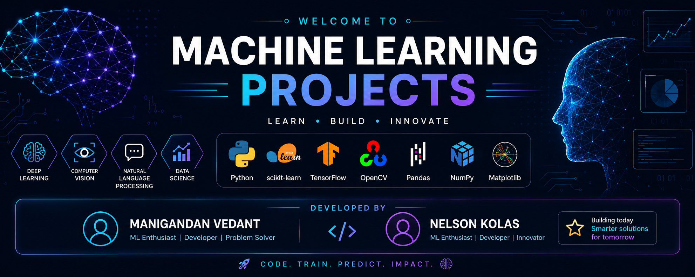

<p align="center">
  
</p>

<h1 align="center">🚀 Machine Learning Projects</h1>

<p align="center">
A curated collection of Machine Learning, Deep Learning, Computer Vision, and Natural Language Processing (NLP) projects built using Python and modern AI frameworks.
</p>

<p align="center">


</p>

---

# 👨‍💻 Developers

| Name | GitHub |
|------|--------|
| **Manigandan Vedant** | https://github.com/Electroxadict |
| **Nelson Kolas** | Contributor |

---

# 📖 About

This repository contains multiple Machine Learning and Artificial Intelligence projects covering

- Machine Learning
- Deep Learning
- Computer Vision
- Natural Language Processing
- Time Series Forecasting
- Predictive Analytics
- Data Science

These projects are intended for educational purposes, portfolio demonstration, experimentation, and learning.

---

# 📂 Projects

| Project | Domain |
|----------|--------|
| 🤖 AI Room Booking Chatbot | NLP |
| 🧠 Brain Tumor Detection | Deep Learning |
| ❤️ Heart Disease Prediction | Machine Learning |
| 🩺 Diabetes Prediction | Machine Learning |
| 👨 Gender & Age Detection | Computer Vision |
| 🚶 Human Activity Detection | Computer Vision |
| 👥 Human Detection & Counting | OpenCV |
| 🛣 Lane Line Detection | Computer Vision |
| 🌸 Iris Flower Classification | Classification |
| 🏏 IPL Score Prediction | Regression |
| 💰 Loan Repayment Prediction | Machine Learning |
| 💼 Employee Turnover Prediction | Machine Learning |
| 🧬 Mechanism of Action Prediction | Deep Learning |
| 💬 Medical Chatbot | NLP |
| 🏘 Property Maintenance Fine Prediction | Machine Learning |
| 📚 Research Topic Prediction | NLP |
| 😊 Smile Selfie Capture | OpenCV |
| 😴 Drowsiness Detection | Computer Vision |
| 😀 Emoji Creator | OpenCV |
| 🍷 Wine Quality Prediction | Classification |
| 📈 Time Series Sales Prediction | Forecasting |
| 🌍 Battle of Neighborhoods | Data Science |

---

# 🛠 Tech Stack

- Python
- TensorFlow
- Keras
- Scikit-Learn
- OpenCV
- NumPy
- Pandas
- Matplotlib
- Flask
- Jupyter Notebook

---

# 📁 Repository Structure

```text
Machine-Learning-Projects
│
├── AI Room Booking Chatbot
├── Brain Tumor Detection
├── Diabetes Prediction
├── Heart Disease Prediction
├── Human Activity Detection
├── Human Detection & Counting
├── Medical Chatbot
├── Wine Quality Prediction
├── Time Series Sales Prediction
├── README.md
├── LICENSE
└── images
    └── banner.png
```

---

# 🚀 Installation

Clone the repository

```bash
git clone https://github.com/Electroxadict/Machine-Learning-Projects.git
```

Move into the project folder

```bash
cd Machine-Learning-Projects
```

Install dependencies

```bash
pip install -r requirements.txt
```

Run any project according to its documentation.

---

# ⭐ Features

- Machine Learning Projects
- Deep Learning Models
- Computer Vision Applications
- NLP Projects
- End-to-End AI Solutions
- OpenCV Applications
- Data Science Projects
- Time Series Forecasting

---

# 📌 Disclaimer

This repository is created for educational, research, and portfolio purposes. Some projects may include publicly available datasets or pre-trained models. Please review the individual project folders for dataset sources, licensing information, and documentation before reuse.

---

# 🤝 Contributing

Contributions are welcome.

If you'd like to improve an existing project or add a new one:

1. Fork the repository
2. Create a new branch
3. Commit your changes
4. Open a Pull Request

---

# 📜 License

This project is licensed under the **MIT License**.

See the **LICENSE** file for details.

---

# 📧 Contact

**Manigandan Vedant**

GitHub: https://github.com/Electroxadict

---

<p align="center">

### ⭐ If you found this repository useful, please consider giving it a Star ⭐

Made with ❤️ by **Manigandan Vedant** & **Nelson Kolas**

</p>